<div align="center">

</div>

# Hands-On Workshop — IoT with Simulink, ThingSpeak & ESP32

## Simulink IoT Monitoring Model (EN)

| Metadata | |
|----------|---|
| **Duration** | 120 minutes (30 min IoT setup + 40 min model build + 30 min deploy & live data + 20 min challenge) |
| **Audience** | Undergraduate, engineering background (beginner-to-intermediate) |
| **MATLAB Products** | MATLAB, Simulink, Embedded Coder *(as reported by the MATLAB Dependency Analyzer)* |
| **ESP32 support (add-on)** | Simulink Support Package for Arduino Hardware — a support package, not a toolbox (`ver` will not list it) |
| **Platform** | ThingSpeak (MathWorks IoT analytics) over MQTT + Wi-Fi |
| **Target Hardware** | ESP32-WROOM (Arduino-compatible) — 1 board per group of 3 |
| **Prerequisite Knowledge** | Basic MATLAB (variables, scripts) and basic Simulink (blocks, simulation) |

---

## 0. Workshop Overview

In this 2-hour hands-on workshop you build a **Simulink® model that runs on an ESP32**, reads sensor data, and publishes it live to a **ThingSpeak™ channel** over MQTT. The model also demonstrates a closed IoT loop: it reads its own channel back and drives both a simulated and a physical output.

| Signal | Source | ThingSpeak field |
|--------|--------|------------------|
| **TemperatureData** | Analog input (or simulation knob) | **Field 1** |
| **ThresholdData** | Analog input / threshold knob | **Field 2** |
| **FanControl** | TemperatureData > ThresholdData | **Field 3** |

You work through the workshop in six phases:

1. ✅ **Prepare the tools** — verify MATLAB product set, install the ESP32 hardware support, and connect the board.
2. ✅ **Create a ThingSpeak account & channel** — field names, Channel ID, Write/Read/MQTT keys.
3. ✅ **Explore the starter model** — the simulation scaffolding is already wired (knobs, switches, displays).
4. ✅ **Build the IoT + hardware blocks** — analog inputs, DAC loop-back, threshold logic, MQTT publish and read-back.
5. ✅ **Deploy & stream live** — run in external (Monitor & Tune) mode, watch the ThingSpeak charts update.
6. ✅ **Challenge** — change the update rate, add a field, and watch the physical output react.

> 💡 The **completed model** (`models/SimulinkIoTThingSpeak_complete.slx`) is your answer key. Use it if you fall behind — but try to build it yourself from the **starter** first.

---

## 1. Learning Objectives

After this session you will be able to:

1. ✅ Verify the required MathWorks products (MATLAB, Simulink, Embedded Coder) and the ESP32 hardware support package.
2. ✅ Create a **ThingSpeak account** and a **private channel** with named fields.
3. ✅ Locate a channel's **Channel ID, Write API Key, Read API Key, and MQTT API Key**.
4. ✅ Configure the ESP32 target (board selection, external mode, Wi-Fi, ThingSpeak credentials).
5. ✅ Build an IoT Simulink model: analog input, scaling, threshold logic, **MQTT publish**, **ThingSpeak read-back**.
6. ✅ Run the model in **external (Monitor & Tune)** mode and watch live data appear in ThingSpeak.
7. ✅ Interpret the generated embedded C code path (ERT, XCP on Serial).

---

## 2. Step 0 — Verify Toolboxes & Connect the ESP32 (~10 min)

Open MATLAB and run the project file first so the path and settings are configured:

```matlab
>> openProject('SimulinkIoTThingSpeak.prj')
```

Define the model's **tunable parameters** before you build or run it — this creates `SensorKnob` and `ThresholdKnob` in the base workspace:

```matlab
>> run('data/TunableParameter.m')   % creates SensorKnob (3072) & ThresholdKnob (2048)
>> SensorKnob.Value, ThresholdKnob.Value   % confirm they now exist
```

`SensorKnob` and `ThresholdKnob` are `Simulink.Parameter` objects with **`ExportedGlobal`** storage. The completed model and the Dashboard knobs read them from the base workspace — if you skip this, the model cannot resolve the parameters. **Re-run the script whenever you reopen MATLAB.**

Verify every required product is installed:

```matlab
>> ver('simulink')      % Simulink
>> ver('ecoder')        % Embedded Coder
```

> 🪟 **Run these in the MATLAB Command Window.** A version table means the product is installed. If missing, install it from **Home → Add-Ons → Get Add-Ons**.

**The ESP32 support is a *Support Package*, not a Toolbox — `ver` will NOT list it.** Open the Add-On Explorer:

```matlab
>> supportPackageInstaller
```

Confirm **"Simulink Support Package for Arduino Hardware"** is **Installed** (installing it enables the ESP32-WROOM board and the Wi-Fi/MQTT blocks). If not, select it and click **Install** (a MathWorks account is required).

Connect the ESP32 over USB and confirm the board is seen:

```matlab
>> arduinolist          % lists board name + COM port
```

Record the **COM port** (e.g. `COM8`). The completed model uses **external mode (XCP on Serial) at 921600 baud** on that port.

> 🎤 **Narration (presenter):** "Everything in IoT comes back to three questions: *how do I get data in, where does it go, and how do I get it back?* Today the ESP32 is our gateway — it reads the sensor, publishes over MQTT to ThingSpeak, and reads its own channel back. That is a complete IoT loop."

---

## 3. Step 1 — Create a ThingSpeak Account & Channel (~10 min)

> 🌐 This step is done in a web browser. Use your **own MathWorks / ThingSpeak account** — every group creates its **own channel and its own keys**.

### 3a. Create the account

1. Open **https://thingspeak.mathworks.com** in a browser.

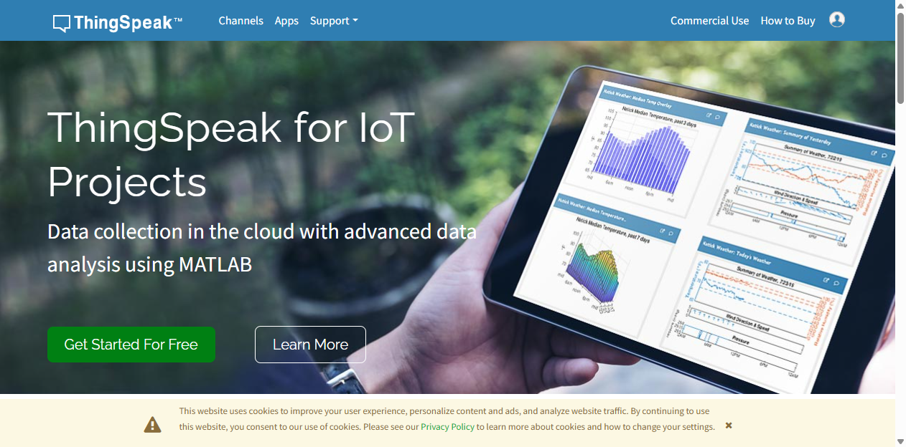
*Figure 1: The ThingSpeak landing page. From here, click **Sign In** (top-right) or **Get Started For Free**.*

2. Click **Sign In**. If you do not yet have a MathWorks account, click **Create Account** on the MathWorks sign-in page and complete the registration (name, email, password).
3. After sign-in you land on your ThingSpeak dashboard.

### 3b. Create a private channel

1. From the top navigation click **Channels → My Channels**.
2. Click **New Channel** (or **+ New Channel**).
3. In the **Channel Settings** form fill in the channel fields **exactly as in Table 1** — the field names must match the signals the model publishes.

| Setting | Value |
|---------|-------|
| **Name** | `ESP32MQTT` |
| **Description** | `IoT workshop with ThingSpeak MQTT and ESP32` |
| **Field 1** | `TemperatureData` |
| **Field 2** | `ThresholdData` |
| **Field 3** | `FanControl` |
| Field 4–8 | *(leave blank)* |

4. Click **Save Channel**.

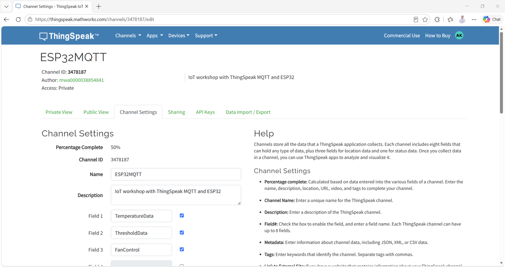
*Figure 2: The Channel Settings page after saving — Field 1 = TemperatureData, Field 2 = ThresholdData, Field 3 = FanControl.*

### 3c. Collect the four credentials

Open the channel (**Channels → My Channels → your channel**), then open the **API Keys** tab.

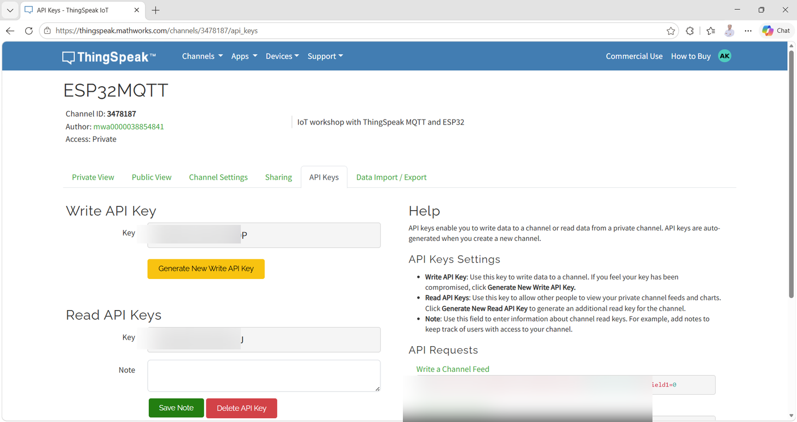
*Figure 3: The API Keys tab shows the Write API Key, Read API Key(s), and REST/MQTT examples. The demo channel's key values are **blurred** for privacy; your own channel will show its own keys.*

Record these for Step 3/4 — you will enter them into the Simulink model:

| Credential | Where to find it | Demo channel value (reference only) |
|------------|------------------|-------------------------------------|
| **Channel ID** | Channel header | `3478187` |

> ⚠️ **Keep keys private.** The Write key lets anyone write to your channel. Use your own keys in the model — never commit another user's key.

> 🎤 **Narration (presenter):** "Notice the field names — `TemperatureData`, `ThresholdData`, `FanControl`. Those are not just labels. ThingSpeak stores every value in a numbered field, and the model builds the message `field1=…&field2=…&field3=…` that exactly matches this channel. Get the names wrong and the data lands in the wrong field."

---

## 4. Step 2 — Explore the Starter Model (~5 min)

```matlab
>> open_system('models/SimulinkIoTThingSpeak_starter.slx')
```

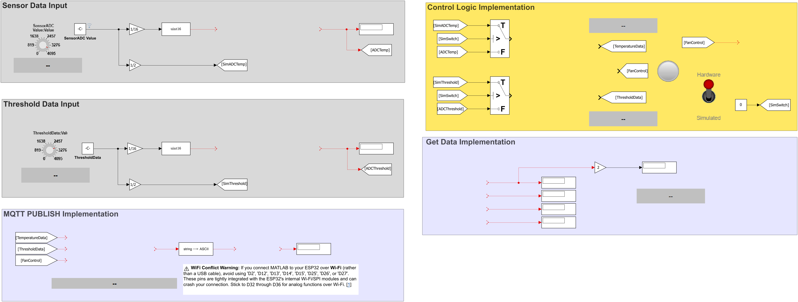
*Figure 4: The **starter model** opens with the simulation scaffolding already wired — dashboard knobs, a Sim/HW source selector, threshold constant, GoTo/From signal routing, and displays.*

The starter already contains (read-only for this step):

- **Knob / Knob1** — dashboard inputs (`ScaleMax = 4095`, matching the ESP32 12-bit ADC).
- **SensorADC Value** and **ThresholdData** (constants, `~3620` / `~2951` in the starter) — the *simulation* values the knobs tune. In the **completed** model these become **tunable parameters** `SensorKnob` / `ThresholdKnob` (defined in `data/TunableParameter.m`).
- **Sensor Data Source** — a custom tuning web component (the Sim ↔ Hardware toggle).
- **Switch / Switch2** — select the **Simulated** input (from the knobs) or the **Hardware** input (from the ESP32 ADC, added in Step 4).
- **GoTo/From blocks** — tags `SimADCTemp`, `SimThreshold`, `ADCTemp`, `ADCThreshold`, `TemperatureData`, `ThresholdData`, `FanControl` carry signals between the two halves of the model.
- **Displays & Lamp** — visualize scaled values and on/off states.

> 🎤 **Narration (presenter):** "The starter model is the wiring harness — all the *plumbing* is already there. Notice the `GoTo`/`From` tags: they work like named buses so we can route a signal across the canvas without drawing every wire. Your job now is to add the *engine*: the real ADC inputs, the threshold logic, and the IoT blocks that talk to ThingSpeak."

---

## 5. Step 3 — Configure the ESP32 Target (~5 min)

Open **Model Settings** (**Ctrl+E**) and check the following:

| Tab | Setting | Value |
|-----|---------|-------|
| **Solver** | Type | `Fixed-step` |
| | Solver | `discrete (no continuous states)`; Fixed-step size `auto` |
| **Hardware Implementation** | Hardware board | `ESP32-WROOM (Arduino Compatible)` |
| | Sample time | `0.01` (from the Analog Input blocks) |
| **Hardware Implementation → Target hardware resources → External mode** | Configuration | `XCP on Serial` |
| | COM port | your `arduinolist` port (e.g. `COM8`) |
| | Baud rate | `921600` |
| **Hardware Implementation → Target hardware resources → Wi-Fi** | SSID | your access point name |
| | Password (WPA) | your Wi-Fi password |
| **Hardware Implementation → Target hardware resources → ThingSpeak / MQTT** | Channel ID | your Channel ID |
| | Write / MQTT API key | your own keys |

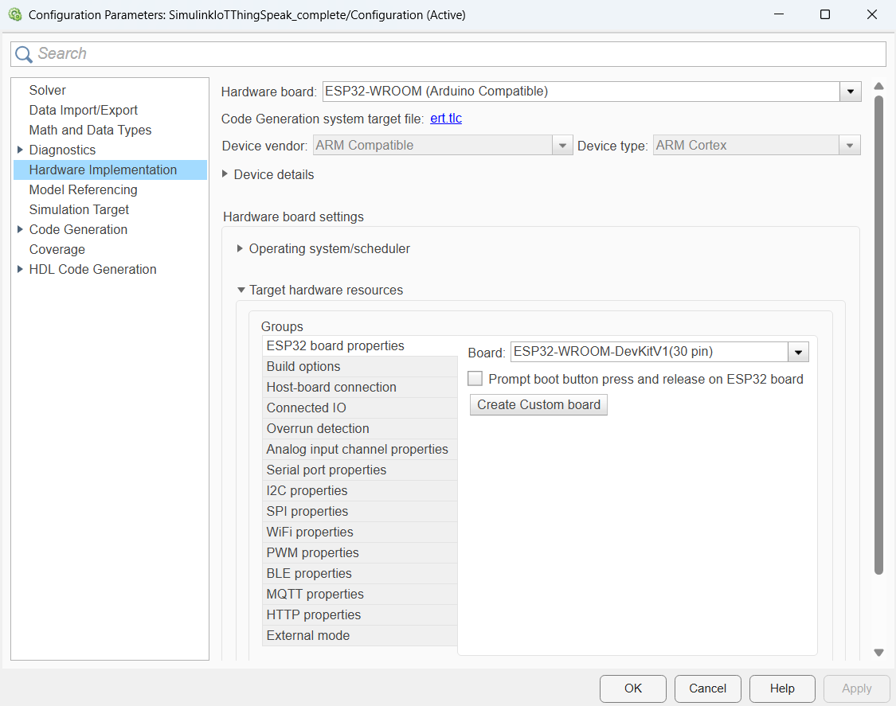
*Figure 5: **Model Settings → Hardware Implementation** (opened with `Ctrl+E`). The ESP32-WROOM (Arduino Compatible) board, `ert.tlc` code-generation target, and the target hardware resources (Wi-Fi, external mode) are configured here.*

**Code-generation optimization (Model Settings → Code Generation → Optimization):**

- **Default parameter behavior** = `Inlined` (parameters inlined; `RTWInlineParameters = on`, access **Literals**).
- **Tunable parameters** — `SensorKnob` and `ThresholdKnob` are `Simulink.Parameter` objects with **`ExportedGlobal`** storage, defined in **`data/TunableParameter.m`** (`SensorKnob.Value = 3072`, `ThresholdKnob.Value = 2048`). Because they are tunable, you can change them **live** in external (Monitor & Tune) mode without a rebuild — the Dashboard knobs drive them.
- **Optimization level** = standard (`OptimizationPriority` `Balanced`); buffer and block-I/O storage optimization off — keeps the generated code simple and readable.

> 💡 The completed model ships with **placeholder** credentials (`YOUR_WIFI_SSID`, `YOUR_WIFI_PASSWORD`, `YOUR_MQTT_USERNAME`, `YOUR_MQTT_PASSWORD`, `YOUR_READ_API_KEY`). **Replace them with your own Wi-Fi and channel** so the data flows to *your* ThingSpeak account — the block dialogs and target-resource settings read these values at build time.


---

## 6. Steps 4–7 — Build the IoT & Hardware Blocks (~40 min)

> All blocks below appear in the **completed model** (`models/SimulinkIoTThingSpeak_complete.slx`). Add them to the starter and wire them to the existing GoTo/From tags.

### Step 4: Analog inputs + DAC loop-back

From the **Simulink Support Package for Arduino** library (`arduinolib`) add:

1. Two **Analog Input** blocks.
   - Settings: **Pin = 4** and **Pin = 5** (the ADC pins the sensors are wired to); **Sample time = 0.01**; output `uint16`.

   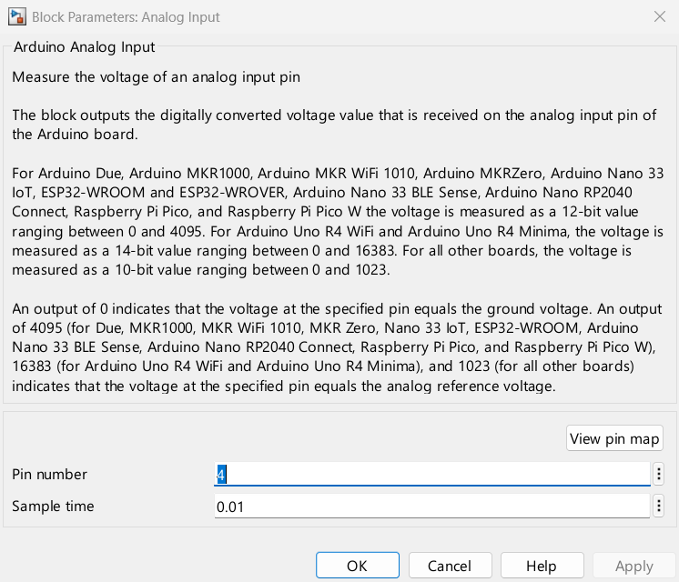
   *Figure 6: The **Analog Input** dialog — **Pin = 4** for the temperature sensor, **Sample time = 0.01**, output `uint16`.*
2. Wire them (via the **Gain** `1/16` scaling and a **Data Type Conversion** to `uint16`) into the `ADCTemp` / `ADCThreshold` GoTo tags, so the **Switch** blocks can select them in Hardware mode.
3. Add two **Analog Output** blocks and set their pins to **DAC1** and **DAC2**. Wire the scaled ADC values into them — this creates a real **ADC → DAC loop-back** on the ESP32: turn the potentiometer and the DAC output voltage follows it.

> 🔑 **Why 1/16?** The ESP32 ADC returns 0–4095 (12-bit). `4096 ÷ 256 = 16`, so `Gain = 1/16` maps the full ADC range onto the 8-bit DAC range (0–255) — no saturation, full travel.

### Step 5: Publish to ThingSpeak over MQTT

The model builds a payload string and publishes it every 60 s.

1. Add a **Compose String** block. In its dialog set:
   - **Format** = `field1=%d&field2=%d&field3=%d`
   - **Inputs**: wire `From_TemperatureData` → input 1, `From_ThresholdData` → input 2, `From_FanControl` → input 3.

   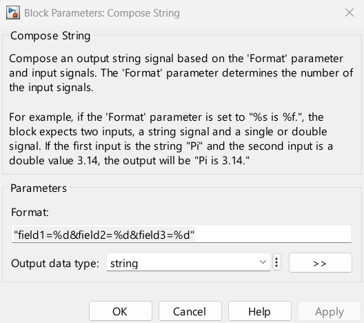
   *Figure 7: The **Compose String** dialog — the `Format` field is the ThingSpeak payload template `field1=%d&field2=%d&field3=%d`.*

2. The starter already has a **String to ASCII** block (output vector size `128`). Wire the Compose String output into it — MQTT transmits the payload as an ASCII byte vector.

   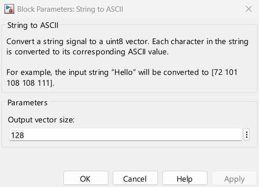
   *Figure 8: The **String to ASCII** dialog — **Output vector size** `128`.*

3. Add a **WiFi MQTT Publish** block (`arduinowifilib`) and set:
   - **Broker service** = `ThingSpeak`
   - **Topic** = `channels/<YOUR_CHANNEL_ID>/publish`
   - **Update interval** = `60` (seconds)
   - Wire the `String to ASCII` output into its input. Connect its **Output** to a **Display** (shows publish status / error code).

   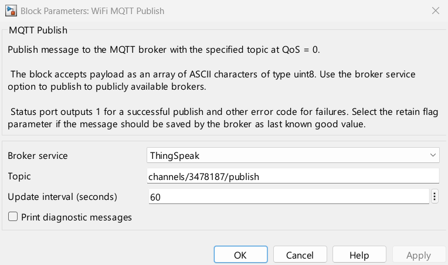
   *Figure 9: The **WiFi MQTT Publish** dialog — Broker service = `ThingSpeak`, **Update interval** = `60` s.*

> 📡 The block uses the **Wi-Fi** and **ThingSpeak MQTT credentials** you set in **Step 3** (Model Settings → Target hardware resources). ThingSpeak's MQTT broker is `mqtt3.thingspeak.com`, port `1883`; the block keeps a persistent connection and publishes on the interval.

### Step 6: Fan / activity logic (threshold)

1. Add a **Relational Operator** and set **Operator = `>`**.
   - **Input 1**: `TemperatureData` · **Input 2**: `ThresholdData`.

   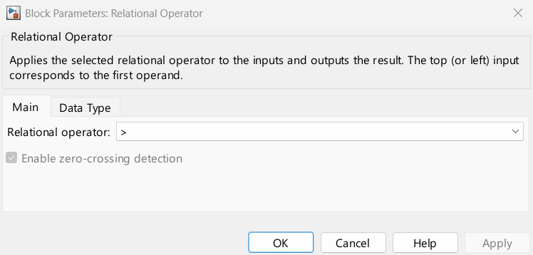
   *Figure 10: The **Relational Operator** dialog — Operator = `>`. Input 1 = TemperatureData, Input 2 = ThresholdData.*

2. Wire its output (`boolean`) into the **FanControl** GoTo tag. The signal is already routed to:
   - the **Compose String** (Field 3) — so the on/off state is published; and
   - `From_FanControl` → **Digital Output** block on **Pin 2** — drives the LED/buzzer on the board.

   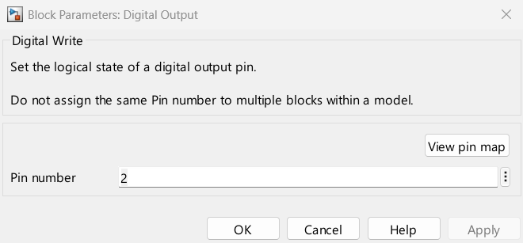
   *Figure 11: The **Digital Output** dialog — **Pin number** `2` (the board's Fan/activity output).*

When `TemperatureData > ThresholdData`, `FanControl = 1` and **D2 turns on**.

### Step 7: Read your own channel back (closed loop)

1. Add a **WiFi ThingSpeak Read** block (`arduinowifilib`) and set:
   - **Channel ID** = your **Channel ID**
   - **Interface** = `Wi-Fi`; **Channel access** = `Private`
   - **Read API key** = your Read key
   - **Fields to read** = `[1 2 3]`
   - **Sample time** = `15` (seconds)

   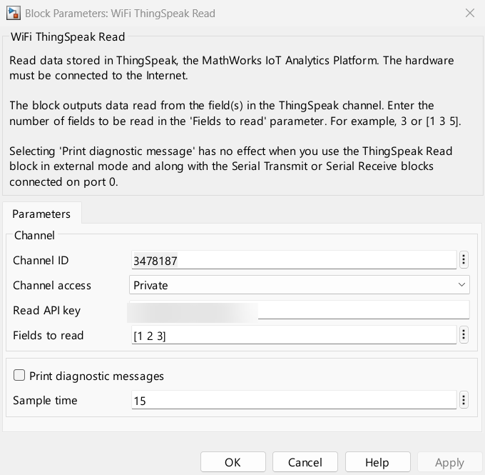
   *Figure 12: The **WiFi ThingSpeak Read** dialog — Channel ID, Read API key, **Fields to read** = `[1 2 3]`, **Sample time** = `15` s.*
2. Wire its **Outputs 2, 3, 4** into three **Display** blocks. Output 1 is the request status.

This gives you a *read-back* loop: whatever the ESP32 publishes appears back in the Displays within ~15 s — proving the round trip through the cloud.

### Save & update

```matlab
>> set_param('SimulinkIoTThingSpeak_complete','SimulationCommand','update')
>> save_system('SimulinkIoTThingSpeak_complete')
```

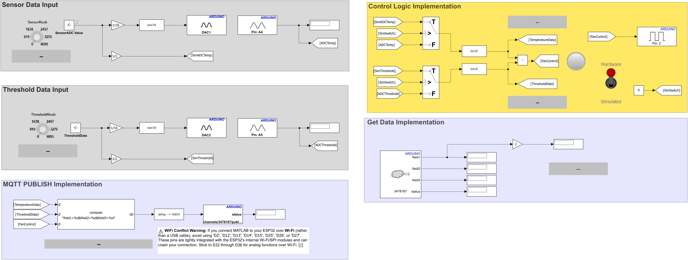
*Figure 13: The **completed model**. Analog inputs (ADC)×2 feed the scaling/DAC loop-back and the Sim↔Hardware switches; the Compose String → String to ASCII → MQTT Publish chain exits top-centre; the Relational Operator drives FanControl; and WiFi ThingSpeak Read returns the channel's own data to the displays.*

---

## 7. Step 8 — Deploy & Stream Live Data (~15 min)

Because **external mode** is enabled, MATLAB **builds, uploads, and runs** the model on the ESP32, then lets you **Monitor & Tune** over the XCP-on-Serial link.

### Step 8a — Run with Monitor & Tune (Hardware tab)

1. In the model toolstrip, open the **Hardware** tab.
2. In the **Run on Hardware** group, click **Monitor & Tune**.

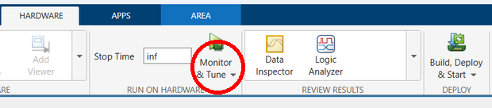
*Figure 14: On the **Hardware** tab, click **Monitor & Tune** (red circle) — MATLAB builds, uploads and starts the model on the ESP32 in external mode.*

> ⚠️ **First run:** the model reads `SensorKnob` / `ThresholdKnob` from the base workspace. If the build fails with an *"undefined variable"* error, run `run('data/TunableParameter.m')` first (Step 0), then click **Monitor & Tune** again.

MATLAB compiles the Embedded Coder (ERT) code, flashes the ESP32 over the configured COM port, connects XCP on Serial, and the data stream starts.

While it runs you can **Monitor & Tune** live:
   - Flip the **Sensor Data Source** toggle to switch between **Simulated** knobs and **Hardware** ADC inputs.
   - Turn **Knob / Knob1** to change `SensorKnob` / `ThresholdKnob` (`TemperatureData` / `ThresholdData`) live — both are **tunable parameters** (`ExportedGlobal`), so they update without a rebuild.
   - Watch the **Displays** and the **Lamp** react in real time.

Now open **ThingSpeak → Channels → My Channels → your channel → Private View**:

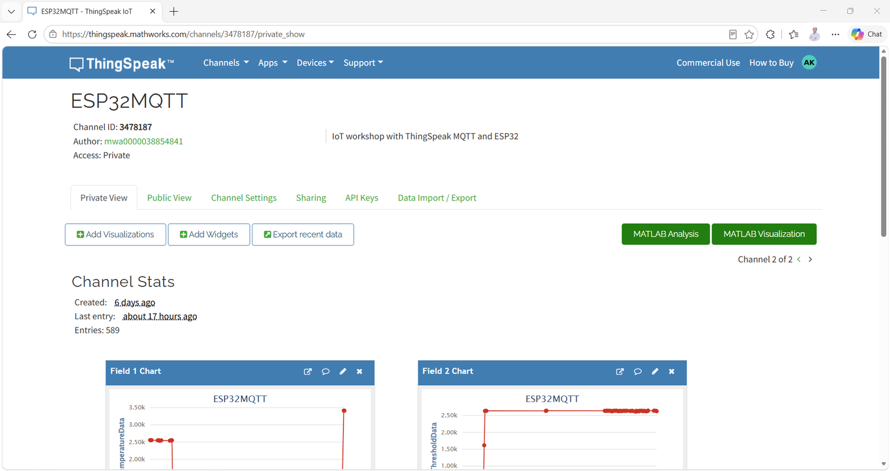
*Figure 15: Live Field 1–3 charts on the ThingSpeak channel after the ESP32 starts publishing. Field 1 = TemperatureData, Field 2 = ThresholdData, Field 3 = FanControl.*

> ✅ **Pass criterion:** within ~60 s of **Run**, new samples appear on **Field 1 and Field 2** charts, and **Field 3** flips between `0`/`1` as you cross the threshold with the knob. The **Displays** fed by *WiFi ThingSpeak Read* refresh the same values back on the model.

> 🎤 **Narration (presenter):** "This is the IoT loop made visible: the ESP32 reads → publishes over MQTT → ThingSpeak stores it → the model reads its own channel back. If you can see Field 3 flipping in the cloud while you drag the knob, every link in the chain works."

---

## 8. Step 9 — Validate the Field Mapping

| Model signal | Block chain | ThingSpeak field | Expected on the channel |
|--------------|-------------|------------------|--------------------------|
| `TemperatureData` | ADC/sim → scaling → Compose String input 1 | **Field 1** | ~0–4095 ADC value |
| `ThresholdData` | ADC/sim → scaling → Compose String input 2 | **Field 2** | ~0–4095 threshold |
| `FanControl` | `TemperatureData > ThresholdData` → Compose String input 3 | **Field 3** | `0` or `1` |

If a field is empty or wrong:
- Field names in the channel must equal the block/variable names **exactly** (`TemperatureData`, `ThresholdData`, `FanControl`).
- The **Compose String format** must be `field1=%d&field2=%d&field3=%d`.
- The **MQTT topic** must be `channels/<YOUR_CHANNEL_ID>/publish` (your Channel ID, not the demo's `3478187`).

---

## 9. Challenge (~10 min)

1. **Speed it up:** change the **Update interval** of *WiFi MQTT Publish* from `60` to `30` seconds. Re-run and watch the Field 1 chart update twice as fast. Keep in mind ThingSpeak's free-tier write limits.

---

## 10. Summary

| Phase | Command / Action | Key Takeaway |
|-------|------------------|--------------|
| Verify | `ver('simulink')`, `supportPackageInstaller`, `arduinolist` | Know what is installed and which COM port the ESP32 uses |
| IoT setup | ThingSpeak → My Channels → New Channel | Named fields + Write/Read/MQTT keys drive the whole model |
| Configure | Hardware Implementation → ESP32-WROOM, external mode, Wi-Fi, ThingSpeak creds | One place holds every credential the blocks read at build |
| Model | Analog In / DAC, Compose String, MQTT Publish, ThingSpeak Read, `>` comparator | The model is just data-in → publish → read-back |
| Deploy | `SimulationMode = external`, `Ctrl+T` | External (Monitor & Tune) flashes and streams live |
| Observe | ThingSpeak Private View | The cloud confirms the complete IoT loop |

### Architecture Learned

```
ESP32 ADC / dashboard knob ─▶ TemperatureData, ThresholdData
              │
    TemperatureData > ThresholdData ─▶ FanControl
              │
  Compose String "field1=%d&field2=%d&field3=%d"
              │  (String to ASCII, 128)
              ▼
  WiFi MQTT Publish (ThingSpeak, channels/<ID>/publish, 30 s)
              │
              ▼
  ThingSpeak channel (Field 1,2,3)  ◀── WiFi ThingSpeak Read (15 s) ─▶ Displays
```

---

## 11. Troubleshooting

| Issue | Possible Cause | Solution |
|-------|----------------|----------|
| `arduinolist` empty | Board not connected / driver | Re-plug USB; check Device Manager; try another cable/port |
| Port busy at deploy | Serial Monitor or another MATLAB open | Close Serial Monitor; pick the correct COM in Model Settings |
| WiFi publish fails | Wrong SSID / password | Re-enter Wi-Fi credentials in Target hardware resources → Wi-Fi |
| No data on channel | Wrong Channel ID / keys | Verify topic `channels/<ID>/publish` and the Write/MQTT keys in the block + target settings |
| Field 3 always 0 | Wrong `>` operand wiring | Confirm input 1 = TemperatureData, input 2 = ThresholdData; flip operands to test |
| Fields populated wrongly | Field names don't match block names | Rename channel fields to exactly `TemperatureData`, `ThresholdData`, `FanControl` |
| Compose output empty | Format string typo / wrong inputs | Use `field1=%d&field2=%d&field3=%d` wired to inputs 1,2,3 in order |
| External mode won't connect | XCP settings / baud mismatch | Set Configuration = `XCP on Serial`, baud `921600`, correct COM port |
| DAC output stuck | ADC value saturated | Ensure `Gain = 1/16` and Data Type Conversion to `uint16` (no saturating overflow) |

---

## 12. MathWorks References

- [ThingSpeak — Getting Started](https://www.mathworks.com/help/thingspeak/getting-started-with-thingspeak.html)
- [Collect Data in a New Channel](https://www.mathworks.com/help/thingspeak/collect-data-in-a-new-channel.html)
- [ThingSpeak Channels & Charts API](https://www.mathworks.com/help/thingspeak/channels-and-charts-api.html)
- [Write Data with MQTT (ESP32/ESP8266)](https://www.mathworks.com/help/thingspeak/examples.html?category=write-data)
- [Simulink Support Package for Arduino Hardware](https://www.mathworks.com/hardware-support/arduino-simulink.html)
- [MATLAB & Simulink + ThingSpeak](https://www.mathworks.com/hardware-support/thingspeak.html)

---

*Created for Hands-On Workshop · TechSource Systems*